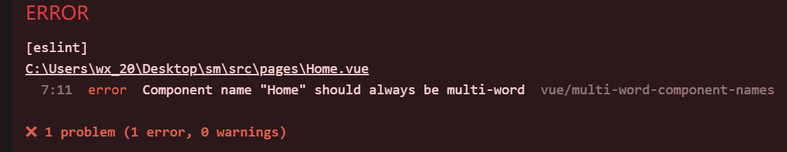
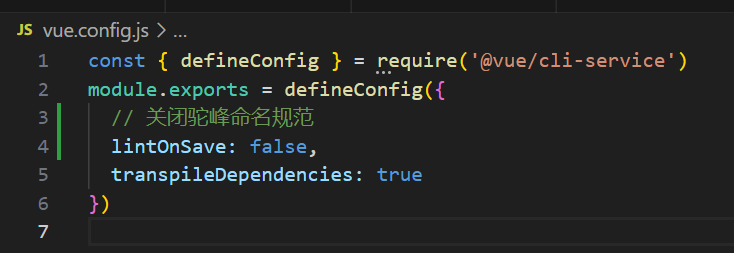

# 前端

## 技术选型

- **[vue2](https://v2.cn.vuejs.org/v2/guide/)：提高开发效率**
- **[bootstarpVue5](https://bootstrap-vue.org/docs)：为了方便响应式开发**
- element-ui

## 开发准备

1. 安装Node.js和npm

2. npm较慢，替换淘宝镜像

   ```bash
   npm config set registry https://registry.npm.taobao.org/
   ```

3. 或者使用 cnpm (推荐)

   ```bash
   npm install -g cnpm
   ```

4. 安装Vue CLI，用来创建项目

   ```bash
   cnpm install -g @vue/cli
   ```

5. 创建项目

   ```bash
   vue create 项目名字
   ```

6. 进入项目

   ```bash
   cd 项目名字
   ```

7. 删除一些不需要的东西

8. 运行项目

   ```bash
   npm run serve
   ```

9. 安装 bootstrapVue模块

   ```bash
   cnpm install vue bootstrap@4.6.1 bootstrap-vue
   ```

10. 在项目main.js中引入模块

    ```js
    import Vue from 'vue'
    import { BootstrapVue, IconsPlugin } from 'bootstrap-vue'
    
    // Import Bootstrap and BootstrapVue CSS files (order is important)
    import 'bootstrap/dist/css/bootstrap.css'
    import 'bootstrap-vue/dist/bootstrap-vue.css'
    
    // Make BootstrapVue available throughout your project
    Vue.use(BootstrapVue)
    // Optionally install the BootstrapVue icon components plugin
    Vue.use(IconsPlugin)
    ```

11. 得引入路由，没路由活不下去

    这里推荐使用 [Vue Router](https://router.vuejs.org/)，vue2用vue-router3的版本

    先安装（npm）

    ```bash
    cnpm install vue-router@3
    ```

    在App.vue中添加路由视图

    ```html
    <!-- 路由匹配到的组件将渲染在这里 -->
    <router-view></router-view>
    ```

    然后在src里创建一个router的文件夹，里面再从创建一个index.js文件，以后写路由就这里

    ```js+
    // 该文件专门用于创建整个应用的路由器
    import VueRouter from "vue-router"
    import Home from '../pages/Home.vue'
    
    export default new VueRouter({
        // mode: 'history',
        routes: [
            {
                path: '/',
                component: Home
            },
        ]
    })
    ```

    然后在main.js中引入即可

    ```js
    import Vue from 'vue'
    import App from './App.vue'
    
    // 引入路由
    import VueRouter from 'vue-router'
    import router from './router'
    Vue.use(VueRouter)
    
    Vue.config.productionTip = false
    
    new Vue({
      render: h => h(App),
      router,
    }).$mount('#app')
    ```

    会遇到的问题：驼峰命名规范

    

    解决方法：

    在vue.config.js文件中配置

    ```
     lintOnSave: false
    ```

    

## 商品展示界面

### 展示所有商品

**展示所有商品，滚轮往下滑请求新数据数据，每个商品需要展示图片，进价，售价，和最低售价**

### 可以搜索商品

**提供一个搜索框，对商品进行搜索操作**

### 通过类型区分展示

**可以区分商品类型，进行展示**

### 后台管理入口

**需要一个登录界面，登录不需要验证码，找回密码邮件发送需要**

## 后台管理界面

### 商品操作

**对商品进行增删改查**

### 操作记录

**查看所有用户的操作记录**

### 用户管理

**root用户才会显示，对用户进行操作**

### 个人用户管理

**修改个人信息，密码修改等**

# 后端

## 技术选型

- **springboot**
- **mybatis-flex：MyBatis 增强框架**
- redis
- mysql8

**学学新知识（[MyBatis-Flex - MyBatis-Flex 官方网站](https://mybatis-flex.com/)）**

## 具体功能

### 登录接口

### 找回密码接口

### 修改密码接口

### 搜索接口

### 图片上传接口

### 注册用户接口

### 删除用户接口

### 修改用户接口

# 数据库

**数据库就用MySql，其它的我也不会呀**

## goods 商品表

**用来登记商品**

### 字段

- id：商品ID

- name：商品名称，不可为空
- purchase_price：进价，可为空
- selling_price：售价，不可为空
- upset_price：最低售价，起拍价，可为空
- cover：封面图片id
- type：商品类型【饮料，生活用品，酒，食品等】
- create_time：创建时间
- update_time：更新时间
- create_user：操作用户
- update_user：更新用户

## user 用户表

默认超级管理者:

账号：root

密码：root

其它子用户都由它分配

### 字段

- id：用户ID
- username：用户账号
- nickname：用户昵称
- role：用户类型：1，管理者；0，普通用户
- password：用户密码，需要MD5加密
- create_time：创建时间
- update_time：更新时间
- email：邮箱账号，用来找回密码
- state：账号状态，1，正常，0，禁用
- ...

## operation_logs 操作记录表

记录用户的操作记录

#### 字段

- id：记录ID
- username：操作的用户
- nickname：用户昵称
- operation：操作记录
- create_time：操作时间
- ...

## goods_picture 商品图片表

- id：图片id
- goods_id：商品id
- create_time：创建时间
- update_time：更新时间

# Docker环境部署

**系统：CentOS 7**

## 准备 Docker

1. 更新系统并安装必要的包：

   ```bash
   sudo yum update
   sudo yum install -y yum-utils device-mapper-persistent-data lvm2
   ```

   可能遇到的问题：

   1. Error: Failed to download metadata for repo 'appstream': Cannot prepare internal mirrorlist: No URLs in mirrorlist
      解决方法：[【已解决】Error: Failed to download metadata for repo ‘appstream‘: Cannot prepare internal mirrorlist_ReadThroughLife的博客-CSDN博客](https://blog.csdn.net/weixin_43252521/article/details/124409151)

      ```bash
      // 进入到 yum 的 repos 目录
      cd /etc/yum.repos.d/
      // 修改 centos 文件内容
      sed -i 's/mirrorlist/#mirrorlist/g' /etc/yum.repos.d/CentOS-*
      sed -i 's|#baseurl=http://mirror.centos.org|baseurl=http://vault.centos.org|g' /etc/yum.repos.d/CentOS-*
      // 生成缓存更新（第一次更新，速度稍微有点慢，耐心等待两分钟左右）
      yum makecache
      // 再次执行
      sudo yum install -y yum-utils device-mapper-persistent-data lvm2
      ```

      

2. 添加Docker的阿里源仓库：

   ```bash
   sudo yum-config-manager--add-repo
       https://mirrors.aliyun.com/docker-ce/linux/centos/docker-ce.repo
   ```

3. 安装Docker：

   ```bash
   sudo yum install docker-ce
   ```

4. 启动Docker服务：

   ```bash
   sudo systemctl start docker
   ```

5. 设置Docker开机自启：

   ```bash
   sudo systemctl enable docker
   ```

## 准备依赖镜像

### MySql8

```dockerfile
docker pull mysql:latest
```

### Redis

```
docker pull mysql:latest
```

### Node.js

```
docker pull node:18.17.1
```

### Nginx

```
docker pull nginx:latest
```

## 启动Redis

```bash
docker run -d --name redis-container -p 6379:6379 redis
```

这个命令将启动一个名为`redis-container`的Redis容器，并将容器内的6379端口映射到主机上的6379端口。这样，您就可以通过访问主机上的6379端口来访问Redis服务了。

默认情况下，Redis容器没有设置密码。如果您需要为Redis容器设置密码，可以在运行`docker run`命令时使用`-e`选项来设置环境变量`REDIS_PASSWORD`：

```bash
docker run -d --name redis-container -p 6379:6379 -e REDIS_PASSWORD=yourpassword redis
```

这个命令将启动一个名为`redis-container`的Redis容器，并将容器内的6379端口映射到主机上的6379端口。同时，还将设置名为`REDIS_PASSWORD`的环境变量，并将其值设置为`yourpassword`。这样，您就可以在容器中使用`AUTH yourpassword`命令来验证密码并访问Redis服务了。

如果您已经运行了Redis容器，并且想要为其设置密码，可以使用以下命令进入Redis容器：

```bash
docker exec -it redis-container redis-cli
```

然后，在Redis客户端命令行界面中执行以下命令：

```bash
CONFIG SET requirepass yourpassword
```

这个命令将设置名为`requirepass`的配置项，并将其值设置为`yourpassword`。现在，您就可以在容器中使用`AUTH yourpassword`命令来验证密码并访问Redis服务了。

## 启动Mysql (安全组添加规则)

1. 启动mysql

    ```bash
    docker run -p 3306:3306 --name mysql -e MYSQL_ROOT_PASSWORD=123456  -d mysql:8.0.20
    ```

2. 配置挂载

    1. 创建挂载目录（请检查保证创建成功）

        ```bash
        mkdir -p /docker/mysql8.0.20/
        ```

    2. 拷贝配置文件到创建的目录下

        ```bash
        docker cp  mysql:/etc/mysql /docker/mysql8.0.20/
        ```

    3. 删除原有容器

        ```bash
        docker stop mysql8
        docker rm -f mysql8
        ```

3. .启动mysql挂载配置文件，数据持久化到宿主主机

    1. 新增my.cnf，进入到上面挂载目录下、因为已经做了cp复制。到目录下新增

        ```bash
        cd /docker/mysql8.0.20/mysql/conf.d
        vim my.cnf
        ```

        写入

        ```
        [mysqld]
        user=mysql
        character-set-server=utf8
        default_authentication_plugin=mysql_native_password
        secure_file_priv=/var/lib/mysql
        expire_logs_days=7
        sql_mode=STRICT_TRANS_TABLES,NO_ZERO_IN_DATE,NO_ZERO_DATE,ERROR_FOR_DIVISION_BY_ZERO,NO_ENGINE_SUBSTITUTION
        max_connections=1000[client]
        default-character-set=utf8[mysql]
        ```

    2. 创建一个sh脚本、把docker启动mysql的命令放到脚本里面。因为后续如果想找到当时启动mysql时候所设置的一些参数和信息、可以查看这个脚本里面是怎么写的。（容器启动有些参数如果不记录、想找的时候忘记当时写了什么参数、很难受有木有）

        ```bash
        vim docker_insert_mysql8.0.20.sh
        ```

        ```
        #!/bin/sh
        docker run \
        -p 3307:3306 \
        --name mysql8 \
        --privileged=true \
        --restart unless-stopped \
        -v /docker/mysql8.0.20/mysql:/etc/mysql \
        -v /docker/mysql8.0.20/logs:/logs \
        -v /docker/mysql8.0.20/data:/var/lib/mysql \
        -v /etc/localtime:/etc/localtime \
        -e MYSQL_ROOT_PASSWORD=123456 \
        -d mysql:8.0.20
        ```

        解释

        ```powershell
        -p 端口映射 【这里有个特殊的地方是把3306映射给了3307、后续链接数据库的时候用3307链接不用3306】--name mysql8  名称是mysql8--privileged=true 挂载文件权限设置--restart unless-stopped 设置 开机后自动重启容器-v /docker/mysql8.0.20/mysql:/etc/mysql \ 挂载配置文件【路径是上面创建的挂载路径】-v /docker/mysql8.0.20/logs:/logs \  挂载日志【路径是上面创建的挂载路径】-v /docker/mysql8.0.20/data:/var/lib/mysql \ 挂载数据文件 持久化到主机【路径是上面创建的挂载路径】-v /etc/localtime:/etc/localtime 容器时间与宿主机同步-e MYSQL_ROOT_PASSWORD=123456 设置密码-d mysql:8.0.20 后台启动,mysql
        ```

    3. 执行docker_insert_mysql8.0.20.sh

        ```bash
        sh docker_insert_mysql8.0.20.sh
        ```

    4. 查看是否成功

        ```
        docker ps
        ```

4. 配置链接信息

    1. 进入mysql8 容器

        ```bash
        docker exec -it mysql8 bash
        ```

    2. 在容器内登录mysql

        ```bash
         mysql -u root -p
        ```

    3. 设置权限（为root分配权限，以便可以远程连接）

        ```bash
        grant all PRIVILEGES on *.* to root@'%' WITH GRANT OPTION;
        use mysqlupdate user set host='%' where user='root';
        ```

    4. 由于Mysql5.6以上的版本修改了Password算法，这里需要更新密码算法，便于使用Navicat连接

        ```bash
        grant all PRIVILEGES on *.* to root@'%' WITH GRANT OPTION;ALTER user 'root'@'%' IDENTIFIED BY '123456' PASSWORD EXPIRE NEVER;ALTER user 'root'@'%' IDENTIFIED WITH mysql_native_password BY '123456';FLUSH PRIVILEGES;
        ```

## 启动Node

```bash
docker run -itd --name node -P 8081:8081 node
```

## 安装 java 17

安装 java 17

```bash
cd /usr/local
wget https://download.oracle.com/java/17/latest/jdk-17_linux-x64_bin.tar.gz
tar -zxvf jdk-17_linux-x64_bin.tar.gz 
# 将jdk-17改名为java
mv jdk-17.0.8 java
```

添加环境变量

```bash
# 进入profile文件，按i进入编辑模式
vim /etc/profile
# 在文件最下方添加
export JAVA_HOME=/usr/local/java
export PATH=$PATH:$JAVA_HOME/bin;
export CLASSPATH=.:$JAVA_HOME/lib/dt.jar:$JAVA_HOME/lib/tools.jar;
# 按下Esc退出编辑模式
# 下一步按住shift 再按俩次 z 键，保存配置文件信息
# 重新加载环境变量
source /etc/profile
# 
cd /
java -version
```

